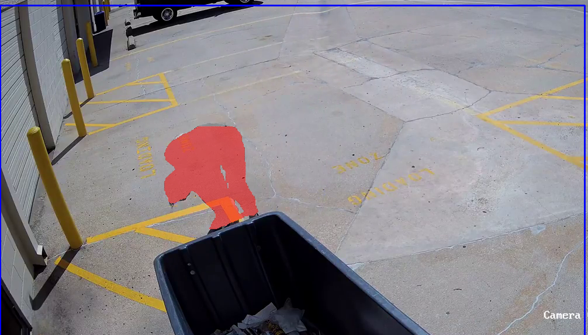

# Privacy Layer in Survillance

The main idea of this demo is to provide privacy in specific areas of survillance footages.

The demo has been built based on Yolov8 and OpenCV

* Run
```bash
python main.py
```

* Expected video output

[](https://youtu.be/PGWtTvy8LZA "demo")

* Improvements:
    - Find real scenerios for your specific application
    - Retrain the model with your custom data
    - Visualization
    - ...

## Note:
*The owner of the original video is someone else*